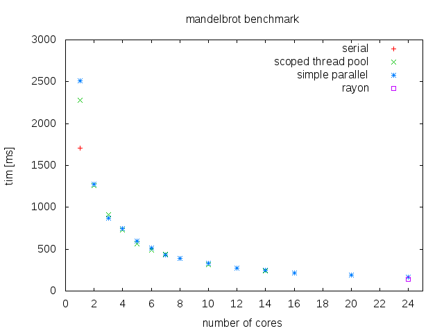

# mandel-rust: Mandelbrot set in Rust

This code shows how to calculate the set in serial and parallel using Rust and various libraries.
More parallel versions (with different libraries) will be added in the future.

Written by Willi Kappler, License: MIT - Version 0.4 (2016.02.28)

Compile with:

    cargo build --release

Run with the default values:

    cargo run --release

Supported command line options:

        --img_size <IMAGE_SIZE>              size of image in pixel (square, default: 2048, must be a power of two)
        --img1 <IMAGINARY1>                  lower part (default: -1.50)
        --img2 <IMAGINARY2>                  upper part (default: 1.50)
        --write_metadata                     write metadata like run time into the ppm file (default: off)
        --no_ppm                             disable creation of the ppm file, just run the calculation (default: off)
        --bench                              use all available CPUs (default: off), will change in the future
        --max_iter <MAX_ITER>                maximum number of iterations (default: 4096)
        --num_threads <NUMBER_OF_THREADS>    number of threads to use (default: 2)
        --num_of_runs=[NUM_OF_RUNS]          number of repetitive runs (default: 1)
        --re1 <REAL1>                        left real part (default: -2.0)
        --re2 <REAL2>                        right real part (default: 1.0)

The main program runs the calculation 9 times: 1 x single threaded and currently 8 x multi threaded.
It writes the mandelbrot set out as PPM image files. For each method one image file is created.

To check if all the images are equal (and thus that all the computations are correct) you can use this command:

    for i in *.ppm; do md5sum $i; done

Or even better:

    for i in *.ppm; do md5sum $i; done | cut -c1-32 | uniq

(This works only if the flag `--write_metadata` has not been set)

Discussion in the Rust user forum:

- [current version (v0.3)](https://users.rust-lang.org/t/mandel-rust-v0-3-more-crates-more-options/4468)

- [old version (v0.2)](https://users.rust-lang.org/t/new-version-of-mandel-rust-uses-rayon-added-benchmark/4403)

# Used crates:
- [Clap](https://github.com/kbknapp/clap-rs): command line parsing
- [Time](https://github.com/rust-lang-deprecated/time): timing each run
- [Num](https://github.com/rust-num/num): complex numbers
- [Num_cpus](https://github.com/seanmonstar/num_cpus): for the `--bench` flag, determine the total number of cpus
- [Scoped threadpool](https://github.com/Kimundi/scoped-threadpool-rs): use scope and thread pool
- [Simple parallel](https://github.com/huonw/simple_parallel): use scope and thread pool
- [Rayon](https://github.com/nikomatsakis/rayon): using recursive divide-and-conquer call with join, use par_iter_mut
- [Rust scoped pool](https://github.com/reem/rust-scoped-pool): use scope and thread pool
- [Jobsteal](https://github.com/rphmeier/jobsteal): use scope and thread pool, use join (divide-and-conquer)
- [Kirk](https://github.com/kinghajj/kirk) + [crossbeam](https://github.com/aturon/crossbeam): use scope and thread pool

# Benchmark:
Measured on a Transtec server with the following specs:
- RAM: 32 GB
- CPU: 2 x Intel Xeon(R) CPU E5-2620 v3 @ 2.40GHz (12 Cores, with hyper threading 24 cores)
- Operating system: 64 bit Ubuntu Server 14.04
- Rust version: rustc 1.6.0 (c30b771ad 2016-01-19)
- Mandel configuration: re1: -2.00, re2: 1.00, img1: -1.50, img2: 1.50, max_iter: 2048, img_size: 1024

(Note: that not all number of cores have been run in the benchmark)

Method | Number of threads | Time taken (in ms)
-------|-------------------|------------------------
serial | 1 | 1703.82371
scoped threadpool v0.1 | 1 | 2283.06639
scoped threadpool v0.1 | 8 | 393.57072
scoped threadpool v0.1 | 24 | 169.02211
simple parallel v0.3 | 1 | 2508.58119
simple parallel v0.3 | 8 | 389.50966
simple parallel v0.3 | 24 | 161.75248
rayon* v0.3 | 24 | 127.69423
rayon par_iter_mut* v0.3 | 24 | 106.66261
rust scoped pool v0.1 | 1 | 2178.49247
rust scoped pool v0.1 | 8 | 318.91450
rust scoped pool v0.1 | 24 | 141.91438
jobsteal v0.4 | 8 | 350.47366
jobsteal v0.4 | 24 | 128.17375
jobsteal join v0.4 | 8 | 245.47314
jobsteal join v0.4 | 24 | 98.78363
kirk git + crossbeam git | 1 | 2432.77082
kirk git + crossbeam git | 8 | 340.31774
kirk git + crossbeam git | 24 | 115.44917

(*) Note that rayon uses whatever number of cores are available at the moment.

With just using one thread the overhead for scoped thread pool, rust scoped pool simple parallel and kirk is too high and thus they are slower than the serial version.
Using all cores (including virtual one due to hyper threading) jobsteal join is the fastest method. It uses explicit work stealing (like Rayon) to utilize all the cores more efficiently.

As always take these results with a grain of salt, they just show a general direction.
If in doubt just do run some benchmarks with different crates for your specific code (which is always a good thing to do).

# TODO:
- [ ] Check [ArrayFire](https://github.com/arrayfire/arrayfire-rust)
- [ ] Check [Collenchyma](https://github.com/autumnai/collenchyma)
- [ ] Check [Timely Dataflow](https://github.com/frankmcsherry/timely-dataflow)
- [ ] Check [forkjoin](https://github.com/faern/forkjoin)
- [ ] Check [rust-stm](https://github.com/Marthog/rust-stm)

- [ ] Automate benchmark: re-run each test multiple times (user specified command line argument) and take the average
- [ ] Automate benchmark: write all results to text files (JSON ?) and make a nice plot

- [x] Use a bigger image size and a higher number of iterations for the next release

Any feedback is welcome!
