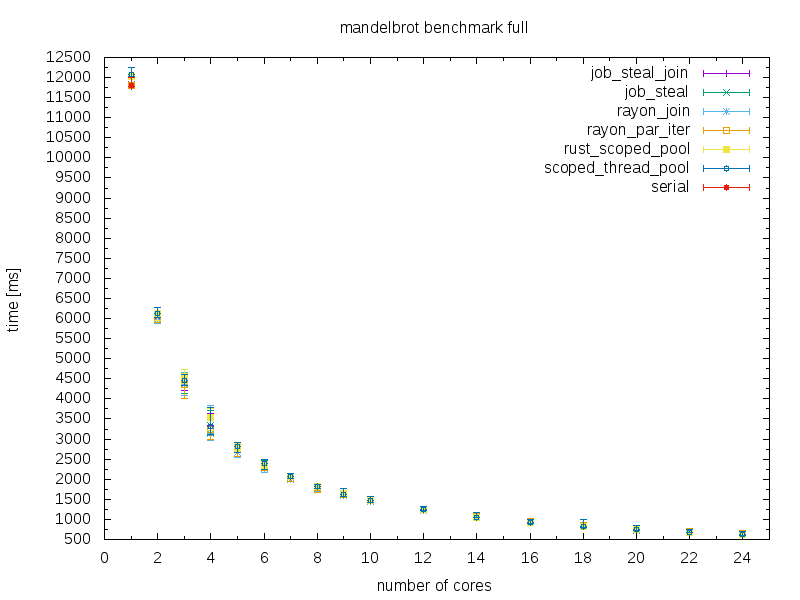
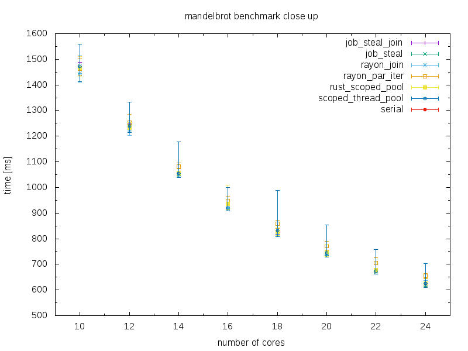

# mandel-rust: Mandelbrot set in Rust

This code shows how to calculate the set in serial and parallel using Rust and various libraries.
More parallel versions (with different libraries) will be added in the future.

Written by Willi Kappler, License: MIT - Version 0.4 (2016.10.01)

Compile with:

    cargo build --release

Run with the default values:

    cargo run --release

Supported command line options:

        --img_size <IMAGE_SIZE>              size of image in pixel (square, default: 2048, must be a power of two)
        --img1 <IMAGINARY1>                  lower part (default: -1.50)
        --img2 <IMAGINARY2>                  upper part (default: 1.50)
        --write_metadata                     write metadata like run time into the ppm file (default: off)
        --no_ppm                             disable creation of the ppm file, just run the calculation (default: off)
        --bench                              use all available CPUs (default: off), will change in the future
        --max_iter <MAX_ITER>                maximum number of iterations (default: 4096)
        --num_threads <NUMBER_OF_THREADS>    number of threads to use (default: 2)
        --num_of_runs=[NUM_OF_RUNS]          number of repetitive runs (default: 2)
        --re1 <REAL1>                        left real part (default: -2.0)
        --re2 <REAL2>                        right real part (default: 1.0)

The main program runs the calculation 7 times: 1 x single threaded and currently 6 x multi threaded.
It writes the mandelbrot set out as PPM image files. For each method one image file is created.

To check if all the images are equal (and thus that all the computations are correct) you can use this command:

    for i in *.ppm; do md5sum $i; done

Or even better:

    for i in *.ppm; do md5sum $i; done | cut -c1-32 | uniq

(This works only if the flag `--write_metadata` has not been set)

A friend also wrote a mandelbrot set application but in C++. He has a very nice and detailed discussion about various aspects of his software. You can read more about it here: [geomandel](https://github.com/crapp/geomandel)

Discussion in the Rust user forum:

- [current version (v0.4)](https://users.rust-lang.org)

- [old version v0.2](https://users.rust-lang.org/t/new-version-of-mandel-rust-uses-rayon-added-benchmark/4403) and [v0.3](https://users.rust-lang.org/t/mandel-rust-v0-3-more-crates-more-options/4468)

# Used crates:
- [Clap](https://github.com/kbknapp/clap-rs): command line parsing
- [Time](https://doc.rust-lang.org/time/time/index.html): timing each run
- [Num](https://github.com/rust-num/num): complex numbers
- [Num_cpus](https://github.com/seanmonstar/num_cpus): for the `--bench` flag, determine the total number of cpus
- [Scoped threadpool](https://github.com/Kimundi/scoped-threadpool-rs): use scope and thread pool
- [Simple parallel](https://github.com/huonw/simple_parallel): use scope and thread pool
- [Rayon](https://github.com/nikomatsakis/rayon): using recursive divide-and-conquer call with join, use par_iter_mut
- [Rust scoped pool](https://github.com/reem/rust-scoped-pool): use scope and thread pool
- [Jobsteal](https://github.com/rphmeier/jobsteal): use scope and thread pool, use join (divide-and-conquer). Thanks to Robert Habermeier for the code!

# Benchmark:
Measured on a Transtec server with the following specs:
- RAM: 32 GB
- CPU: 2 x Intel Xeon(R) CPU E5-2620 v3 @ 2.40GHz (12 Cores, with hyper threading 24 cores)
- Operating system: 64 bit Ubuntu Server 14.04
- Rust version: rustc 1.12.0 (3191fbae9 2016-09-23)
- Mandel configuration: re1: -2.00, re2: 1.00, img1: -1.50, img2: 1.50, max_iter: 4096, img_size: 2048
- Number of repetetive runs: 10

You can use the following lines to reproduce the result:

	for i in $(seq 1 10); do cargo run --release -- --no_ppm --num_of_runs 10 --num_threads $i; done

	for i in $(seq 12 2 24); do cargo run --release -- --no_ppm --num_of_runs 10 --num_threads $i; done

The actual numbers are in the text files under the folder plot/. In order to generate the plot use the gnuplot script in the plot/ folder.

Conclusion: The more threads you use, the closer the results get. On my environment (hardware, OS, Rust version, etc.) Rayon and Jobsteal were the fastest, with Jobsteal beeing a bit faster in more cases.

As always take these results with a grain of salt, they just show a general direction.
If in doubt just do run some benchmarks with different crates for your specific code (which is always a good thing to do).

# TODO:
- [ ] Check [ArrayFire](https://github.com/arrayfire/arrayfire-rust)
- [ ] Check [Collenchyma](https://github.com/autumnai/collenchyma)
- [ ] Check [Timely Dataflow](https://github.com/frankmcsherry/timely-dataflow)
- [ ] Check [forkjoin](https://github.com/faern/forkjoin)
- [ ] Check [rust-stm](https://github.com/Marthog/rust-stm)
- [ ] Check [mpi](https://github.com/bsteinb/rsmpi)

- [x] Automate benchmark: re-run each test multiple times (user specified command line argument) and take the average
- [x] Automate benchmark: write all results to text files and make a nice plot

- [x] Use a bigger image size and a higher number of iterations for the next release

Any feedback is welcome!
